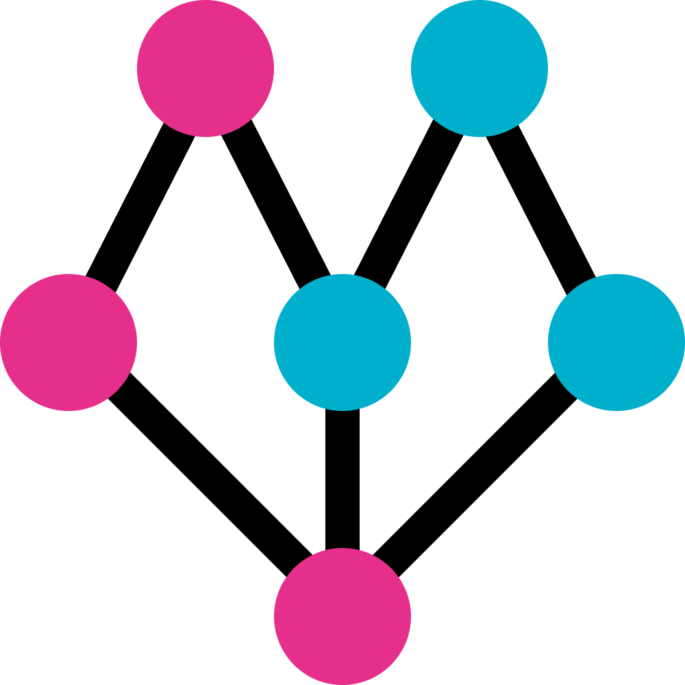

# Pripla



**Princess & Prince date planning service.**

### カンプ

- https://www.figma.com/file/4yro9aYdo3e74E17vFvDOI/Pripla?node-id=0%3A1

### コマンド

```bash
# 環境構築
$ make setup
# 開発用サーバとコンテナの起動
# フロントエンド: localhost:3000
# バックエンド: localhost:8000
$ make up
# コンテナの終了
$ make down
# Dockerのプロセス確認
$ make ps
# シェルの起動
$ make sh
# DBにテーブル作成 + シーダーの実行
$ make db
# Tinkerの起動
$ make tinker
# Linterによるコード修正
$ make lint
```

### API

- タイムラインの取得

Endpoint

```
GET /api/v0/tl
```

Request

```json
{}
```

Response

```json
[
  {
    "id": 1,
    "title": "foo_bar_baz",
    "prefecture": {
      "id": 1,
      "name": "北海道"
    },
    "budget": {
      "id": 1,
      "range": "0 - 1,500円"
    },
    "target": {
      "id": 1,
      "name": "どちらでも"
    }
  },
  ...
]
```

- デートプラン詳細の取得

Endpoint

```
GET /api/v0/detail
```

Request

```json
{
  "id": 1
}
```

Response

```json
{
  "id": 1,
  "title": "foo_bar_baz",
  "prefecture": {
    "id": 1,
    "name": "北海道"
  },
  "budget": {
    "id": 1,
    "range": "0 - 1,500円"
  },
  "target": {
    "id": 1,
    "name": "どちらでも"
  }
}
```

- 地域（都道府県）一覧の取得

Endpoint

```
GET /api/v0/prefectures
```

Request

```json
{}
```

Response

```json
[
  {
    "id": 1,
    "name": "北海道"
  },
  ...
]
```

- 予算の一覧の取得

Endpoint

```
GET /api/v0/budgets
```

Request

```json
{}
```

Response

```json
[
  {
    "id": 1,
    "range": "0 - 1,500円"
  },
  ...
]
```

- ターゲット（男/女/どちらでも可）の取得

Endpoint

```
GET /api/v0/targets
```

Request

```json
{}
```

Response

```json
[
  {
    "id": 1,
    "name": "どちらでも"
  },
  ...
]
```

- 投稿

Endpoint

```
GET /api/v0/post
```

Request

```json
{
  "title": "foo_bar_baz",
  "prefecture_id": 1,
  "budget_id": 1,
  "target_id": 1
}
```

Response

```json
{}
```